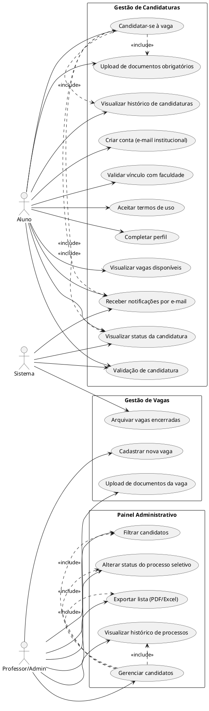

# Documento de Casos de Uso – Sistema de Gestão de Candidaturas

## Padrão
**Título** | **Ator** | **Descrição** | **Pré-condição** | **Fluxo Principal** | **Fluxos Alternativos** | **Pós-condição** | **Regras de Negócio**

---

## Criar conta (e-mail institucional)
**Ator:** Aluno  
**Descrição:** Permite que o aluno crie uma conta utilizando seu e-mail institucional.  
**Pré-condição:** Não possuir cadastro prévio.  
**Fluxo Principal:**  
1. Aluno informa e-mail institucional e dados pessoais.  
2. Sistema valida o e-mail.  
3. Sistema cria a conta e envia confirmação por e-mail.  
**Fluxos Alternativos:**  
a. E-mail inválido: sistema exibe mensagem de erro.  
**Pós-condição:** Conta criada e e-mail de confirmação enviado.  
**Regras de Negócio:** Apenas e-mails institucionais são aceitos.

---

## Validar vínculo com faculdade
**Ator:** Aluno  
**Descrição:** Confirma se o aluno possui vínculo ativo com a instituição.  
**Pré-condição:** Conta criada.  
**Fluxo Principal:**  
1. Aluno fornece informações de matrícula.  
2. Sistema consulta base institucional.  
3. Sistema confirma ou nega o vínculo.  
**Fluxos Alternativos:**  
a. Matrícula não encontrada ou inativa: sistema exibe mensagem de erro.  
**Pós-condição:** Vínculo validado ou negado.  
**Regras de Negócio:** Apenas alunos com vínculo ativo podem prosseguir.

---

## Aceitar termos de uso
**Ator:** Aluno  
**Descrição:** Aluno deve aceitar os termos para prosseguir.  
**Pré-condição:** Conta criada e vínculo validado.  
**Fluxo Principal:**  
1. Sistema exibe termos de uso.  
2. Aluno aceita os termos.  
3. Sistema registra aceite.  
**Fluxos Alternativos:**  
a. Aluno não aceita: cadastro não é concluído.  
**Pós-condição:** Aceite registrado.  
**Regras de Negócio:** Aceite obrigatório para uso do sistema.

---

## Completar perfil
**Ator:** Aluno  
**Descrição:** Permite ao aluno preencher ou atualizar informações do perfil.  
**Pré-condição:** Conta criada e termos aceitos.  
**Fluxo Principal:**  
1. Aluno acessa área de perfil.  
2. Aluno preenche/atualiza dados.  
3. Sistema salva as informações.  
**Pós-condição:** Perfil atualizado.  
**Regras de Negócio:** Dados obrigatórios devem ser preenchidos.

---

## Visualizar vagas disponíveis
**Ator:** Aluno  
**Descrição:** Permite ao aluno consultar vagas abertas.  
**Pré-condição:** Perfil completo.  
**Fluxo Principal:**  
1. Aluno acessa lista de vagas.  
2. Sistema exibe vagas disponíveis.  
**Pós-condição:** Vagas visualizadas.  
**Regras de Negócio:** Apenas vagas abertas são exibidas.

---

## Validação de candidatura
**Ator:** Sistema  
**Descrição:** Valida automaticamente se o aluno atende aos critérios mínimos de CR para se candidatar a uma vaga.  
**Pré-condição:** Aluno selecionou vaga e iniciou candidatura.  
**Fluxo Principal:**  
1. Sistema consulta o CR geral do aluno.  
2. Sistema consulta o CR do aluno na disciplina da vaga.  
3. Sistema verifica se o CR geral é maior ou igual a 7.  
4. Sistema verifica se o CR da disciplina é maior ou igual a 8.  
5. Se ambos os critérios forem atendidos, sistema permite prosseguir com a candidatura.  
**Fluxos Alternativos:**  
a. Se CR geral < 7 ou CR da disciplina < 8: sistema bloqueia candidatura e exibe mensagem de inelegibilidade.  
**Pós-condição:** Candidatura permitida ou bloqueada conforme critérios de CR.  
**Regras de Negócio:** CR geral ≥ 7 e CR da disciplina ≥ 8 são obrigatórios para candidatura.

---

## Candidatar-se à vaga
**Ator:** Aluno  
**Descrição:** Permite ao aluno se candidatar à vaga.  
**Pré-condição:** Perfil completo, vaga disponível e validação de candidatura aprovada.  
**Fluxo Principal:**  
1. Aluno seleciona vaga.  
2. Aluno envia candidatura.  
3. Sistema solicita upload de documentos obrigatórios (inclui Upload de documentos obrigatórios).  
4. Sistema envia notificação por e-mail (inclui Receber notificações por e-mail).  
5. Sistema atualiza status da candidatura (inclui Visualizar status da candidatura e Visualizar histórico de candidaturas).  
**Fluxos Alternativos:**  
a. Documentos não enviados: candidatura não é concluída.  
**Pós-condição:** Candidatura registrada e notificada.  
**Regras de Negócio:** Documentação obrigatória para candidatura.

---

## Upload de documentos obrigatórios
**Ator:** Aluno  
**Descrição:** Permite anexar documentos necessários à candidatura.  
**Pré-condição:** Processo de candidatura iniciado.  
**Fluxo Principal:**  
1. Aluno faz upload dos documentos.  
2. Sistema valida e armazena os arquivos.  
**Fluxos Alternativos:**  
a. Documento inválido: sistema solicita novo envio.  
**Pós-condição:** Documentos anexados à candidatura.  
**Regras de Negócio:** Tipos e formatos de arquivos restritos.

---

## Receber notificações por e-mail
**Atores:** Aluno, Sistema  
**Descrição:** Sistema envia notificações sobre o processo.  
**Pré-condição:** Evento relevante (ex: candidatura enviada, status alterado).  
**Fluxo Principal:**  
1. Sistema identifica evento relevante.  
2. Sistema envia e-mail ao aluno.  
**Pós-condição:** Aluno notificado.  
**Regras de Negócio:** Notificações automáticas para eventos críticos.

---

## Visualizar status da candidatura
**Atores:** Aluno, Sistema  
**Descrição:** Permite acompanhar o andamento da candidatura.  
**Pré-condição:** Candidatura registrada.  
**Fluxo Principal:**  
1. Aluno acessa painel de status.  
2. Sistema exibe situação atual.  
**Pós-condição:** Status visualizado.  
**Regras de Negócio:** Status atualizado em tempo real.

---

## Visualizar histórico de candidaturas
**Ator:** Aluno  
**Descrição:** Permite consultar todas as candidaturas realizadas.  
**Pré-condição:** Aluno autenticado.  
**Fluxo Principal:**  
1. Aluno acessa histórico.  
2. Sistema exibe lista de candidaturas anteriores.  
**Pós-condição:** Histórico visualizado.  
**Regras de Negócio:** Exibe todas as candidaturas do aluno.

---

## Cadastrar nova vaga
**Ator:** Professor/Admin  
**Descrição:** Permite criar uma nova vaga.  
**Pré-condição:** Usuário autenticado como Professor/Admin.  
**Fluxo Principal:**  
1. Admin preenche dados da vaga.  
2. Sistema salva e publica a vaga.  
**Pós-condição:** Vaga cadastrada e publicada.  
**Regras de Negócio:** Apenas Admin pode cadastrar vagas.

---

## Upload de documentos da vaga
**Ator:** Professor/Admin  
**Descrição:** Permite anexar documentos à vaga.  
**Pré-condição:** Vaga cadastrada.  
**Fluxo Principal:**  
1. Admin faz upload dos arquivos.  
2. Sistema armazena os documentos.  
**Pós-condição:** Documentos anexados à vaga.  
**Regras de Negócio:** Tipos e formatos de arquivos restritos.

---

## Arquivar vagas encerradas
**Ator:** Sistema  
**Descrição:** Sistema arquiva vagas automaticamente após o encerramento.  
**Pré-condição:** Vaga encerrada.  
**Fluxo Principal:**  
1. Sistema identifica vagas encerradas.  
2. Sistema arquiva as vagas.  
**Pós-condição:** Vagas arquivadas.  
**Regras de Negócio:** Arquivamento automático ao fim do prazo.

---

## Gerenciar candidatos
**Ator:** Professor/Admin  
**Descrição:** Permite visualizar e gerenciar candidatos.  
**Pré-condição:** Vagas cadastradas.  
**Fluxo Principal:**  
1. Admin acessa painel de candidatos.  
2. Admin pode filtrar (inclui Filtrar candidatos), alterar status (inclui Alterar status do processo seletivo), exportar lista (inclui Exportar lista (PDF/Excel)) e visualizar histórico (inclui Visualizar histórico de processos).  
**Pós-condição:** Candidatos gerenciados.  
**Regras de Negócio:** Apenas Admin pode gerenciar candidatos.

---

## Filtrar candidatos
**Ator:** Professor/Admin  
**Descrição:** Permite aplicar filtros na lista de candidatos.  
**Pré-condição:** Candidatos cadastrados.  
**Fluxo Principal:**  
1. Admin seleciona critérios de filtro.  
2. Sistema exibe candidatos filtrados.  
**Pós-condição:** Lista filtrada exibida.  
**Regras de Negócio:** Filtros por status, vaga, curso, etc.

---

## Alterar status do processo seletivo
**Ator:** Professor/Admin  
**Descrição:** Permite atualizar o status dos candidatos.  
**Pré-condição:** Candidato cadastrado.  
**Fluxo Principal:**  
1. Admin seleciona candidato.  
2. Admin altera status.  
3. Sistema registra alteração.  
**Pós-condição:** Status atualizado.  
**Regras de Negócio:** Histórico de alterações mantido.

---

## Exportar lista (PDF/Excel)
**Ator:** Professor/Admin  
**Descrição:** Permite exportar dados dos candidatos.  
**Pré-condição:** Lista de candidatos disponível.  
**Fluxo Principal:**  
1. Admin solicita exportação.  
2. Sistema gera arquivo PDF/Excel.  
**Pós-condição:** Arquivo exportado.  
**Regras de Negócio:** Exportação conforme filtros aplicados.

---

## Visualizar histórico de processos
**Ator:** Professor/Admin  
**Descrição:** Permite consultar processos seletivos anteriores.  
**Pré-condição:** Processos cadastrados.  
**Fluxo Principal:**  
1. Admin acessa histórico.  
2. Sistema exibe processos anteriores.  
**Pós-condição:** Histórico visualizado.  
**Regras de Negócio:** Exibe todos os processos do Admin.

---

## **Autor(es)**
| Data | Versão | Descrição | Autor(es) |
|-------|--------|-----------|------------|
| 24/09/2025 | 1.0 | Criação do documento | Caique Rechuan, Joao Vitor Donda e Joao Victor Carvalho.
