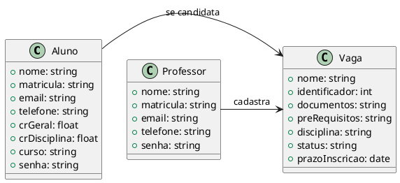

## Classes

### Descrição: 
Este documento apresenta o **Diagrama de Classes** da plataforma de monitoria da IBMEC. O diagrama representa as principais entidades do sistema e seus relacionamentos, servindo como base para o desenvolvimento do **back-end** da aplicação.

### **Objetivo**
O diagrama tem como objetivo organizar a estrutura de dados da plataforma, definindo claramente os atributos e relacionamentos das classes principais, de modo que o desenvolvimento seja consistente e alinhado aos requisitos do projeto.

- Aluno
	- Nome
	- Matrícula
	- Email
	- Telefone
	- Cr Geral
	- Cr disciplina
	- Curso
	- Senha

- Professor
	- Nome
	- Matrícula
	- Email
	- Telefone
	- Senha

- Vaga 	
    - Nome
	- Identificador
	- Documentos
	- Pré-requisitos
	- Disciplina
	- Status
	- Prazo de inscrição

