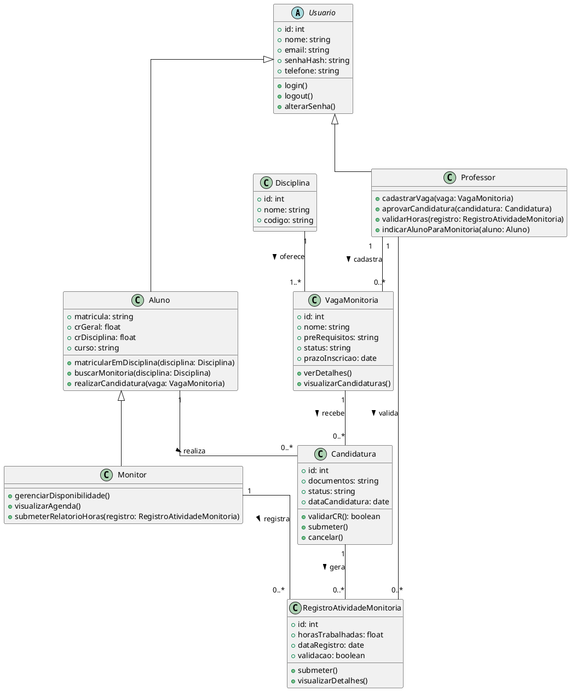

## Classes

### Descrição: 
Este documento apresenta o **Diagrama de Classes** da plataforma de monitoria da IBMEC. O diagrama representa as principais entidades do sistema e seus relacionamentos, servindo como base para o desenvolvimento do **back-end** da aplicação.

### **Objetivo**
O diagrama tem como objetivo organizar a estrutura de dados da plataforma, definindo claramente os atributos e relacionamentos das classes principais, de modo que o desenvolvimento seja consistente e alinhado aos requisitos do projeto.

### Usuario (Classe Abstrata)
Classe base que define atributos e comportamentos comuns a todos os usuários do sistema.

**Atributos:**
- `id`: int
- `nome`: string
- `email`: string
- `senhaHash`: string
- `telefone`: string

**Métodos:**
- `login()`
- `logout()`
- `alterarSenha()`

---

### Aluno
Representa um estudante que pode se candidatar a vagas de monitoria e buscar monitorias disponíveis.

**Atributos:**
- `matricula`: string
- `crGeral`: float
- `crDisciplina`: float
- `curso`: string

**Métodos:**
- `matricularEmDisciplina(disciplina: Disciplina)`
- `buscarMonitoria(disciplina: Disciplina)`
- `realizarCandidatura(vaga: VagaMonitoria)`

**Herança:** Herda de `Usuario`

---

### Monitor
Representa um aluno que foi aprovado para atuar como monitor, com responsabilidades adicionais.

**Métodos:**
- `gerenciarDisponibilidade()`
- `visualizarAgenda()`
- `submeterRelatorioHoras(registro: RegistroAtividadeMonitoria)`

**Herança:** Herda de `Aluno` (um Monitor é um tipo especial de Aluno)

---

### Professor
Representa um professor que pode cadastrar vagas, aprovar candidaturas e validar horas de monitoria.

**Métodos:**
- `cadastrarVaga(vaga: VagaMonitoria)`
- `aprovarCandidatura(candidatura: Candidatura)`
- `validarHoras(registro: RegistroAtividadeMonitoria)`
- `indicarAlunoParaMonitoria(aluno: Aluno)`

**Herança:** Herda de `Usuario`

---

### Disciplina
Representa uma disciplina oferecida pela instituição.

**Atributos:**
- `id`: int
- `nome`: string
- `codigo`: string

---

### VagaMonitoria
Representa uma vaga de monitoria disponível para candidatura.

**Atributos:**
- `id`: int
- `nome`: string
- `preRequisitos`: string
- `status`: string
- `prazoInscricao`: date

**Métodos:**
- `verDetalhes()`
- `visualizarCandidaturas()`

---

### Candidatura
Representa a candidatura de um aluno a uma vaga de monitoria.

**Atributos:**
- `id`: int
- `documentos`: string
- `status`: string
- `dataCandidatura`: date

**Métodos:**
- `validarCR(): boolean`
- `submeter()`
- `cancelar()`

---

### RegistroAtividadeMonitoria
Representa o registro das atividades e horas trabalhadas por um monitor.

**Atributos:**
- `id`: int
- `horasTrabalhadas`: float
- `dataRegistro`: date
- `validacao`: boolean

**Métodos:**
- `submeter()`
- `visualizarDetalhes()`

---

## Relacionamentos

### Heranças
- `Usuario` é classe base de `Aluno` e `Professor`
- `Aluno` é classe base de `Monitor`

### Associações
- **Disciplina → VagaMonitoria**: Uma disciplina oferece uma ou mais vagas (1 → 1..*)
- **Professor → VagaMonitoria**: Um professor cadastra zero ou mais vagas (1 → 0..*)
- **Aluno → Candidatura**: Um aluno realiza zero ou mais candidaturas (1 → 0..*)
- **VagaMonitoria → Candidatura**: Uma vaga recebe zero ou mais candidaturas (1 → 0..*)
- **Candidatura → RegistroAtividadeMonitoria**: Uma candidatura gera zero ou mais registros (1 → 0..*)
- **Professor → RegistroAtividadeMonitoria**: Um professor valida zero ou mais registros (1 → 0..*)
- **Monitor → RegistroAtividadeMonitoria**: Um monitor registra zero ou mais atividades (1 → 0..*)

## **Autor(es)**
| Data | Versão | Descrição | Autor(es) |
|-------|--------|-----------|------------|
| 18/09/2025 | 1.0 | Criação do documento | João Mariano e Sarah Ferrari.
| 16/10/2025 | 2.0 | Criação do documento | João Victor de C.
