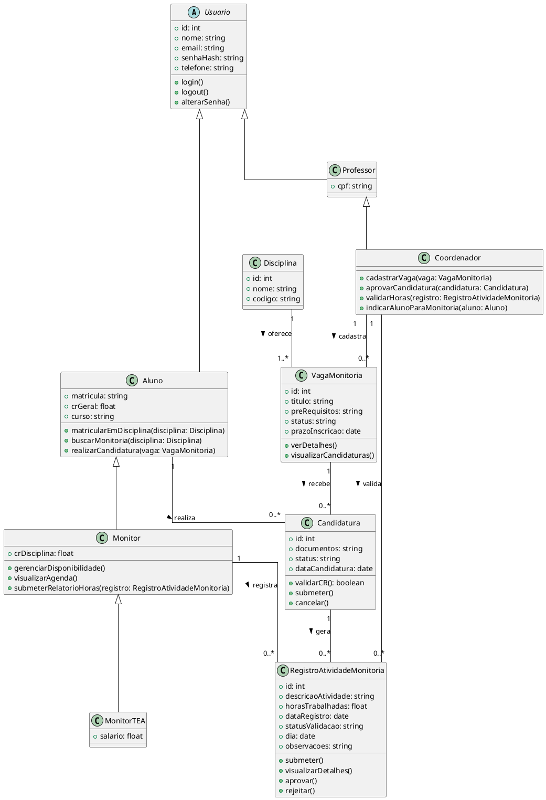

## Classes

### Descrição: 
Este documento apresenta o **Diagrama de Classes** da plataforma de monitoria da IBMEC. O diagrama representa as principais entidades do sistema e seus relacionamentos, servindo como base para o desenvolvimento do **back-end** da aplicação.

### **Objetivo**
O diagrama tem como objetivo organizar a estrutura de dados da plataforma, definindo claramente os atributos e relacionamentos das classes principais, de modo que o desenvolvimento seja consistente e alinhado aos requisitos do projeto.

### 1. Usuario (Classe Abstrata)
Classe base que agrupa atributos e comportamentos comuns a todos os perfis de usuário do sistema.

**Atributos:**
- `id`: `int`
- `nome`: `string`
- `email`: `string`
- `senhaHash`: `string` (Para segurança, armazena o hash da senha)
- `telefone`: `string`

**Métodos:**
- `login()`: `void`
- `logout()`: `void`
- `alterarSenha()`: `void`

---

### 2. Aluno
Representa um estudante matriculado na instituição, com a capacidade de buscar e se candidatar a vagas de monitoria, além de gerenciar suas matrículas em disciplinas.

**Atributos:**
- `matricula`: `string`
- `crGeral`: `float`
- `curso`: `string`

**Métodos:**
- `matricularEmDisciplina(disciplina: Disciplina)`: `void`
- `buscarMonitoria(disciplina: Disciplina)`: `void`
- `realizarCandidatura(vaga: VagaMonitoria)`: `void`

**Herança:** Herda de `Usuario`.

---

### 3. Monitor
Representa um `Aluno` que foi aprovado e atua como monitor. Ele herda todas as características de um aluno e possui responsabilidades adicionais relacionadas à gestão de suas atividades de monitoria.

**Atributos:**
- `crDisciplina`: `float` (Adicionado para consistência, se for específico do Monitor)

**Métodos:**
- `gerenciarDisponibilidade()`: `void`
- `visualizarAgenda()`: `void`
- `submeterRelatorioHoras(registro: RegistroAtividadeMonitoria)`: `void`

**Herança:** Herda de `Aluno`.

---

### 4. MonitorTEA
Representa um `Monitor` que foi aprovado para atuar como monitor remunerado (TEA - Trabalho de Ensino Assistido). Ele herda todas as características de um `Monitor` e possui um atributo específico relacionado à sua remuneração.

**Atributos:**
- `salario`: `float`

**Métodos:**
- _Nenhum método adicional específico, herda de `Monitor`._

**Herança:** Herda de `Monitor`.

---

### 5. Professor
Representa um professor da instituição, responsável por criar e gerenciar vagas de monitoria, bem como validar as atividades e horas dos monitores.

**Atributos:**
- `cpf`: `string` (Atributo adicional para o professor)

**Herança:** Herda de `Usuario`.

---

### 6. Coordenador 
Representa um professor da instituição, responsável por criar e gerenciar vagas de monitoria, bem como validar as atividades e horas dos monitores.

**Métodos:**
- `cadastrarVaga(vaga: VagaMonitoria)`: `void`
- `aprovarCandidatura(candidatura: Candidatura)`: `void`
- `validarHoras(registro: RegistroAtividadeMonitoria)`: `void`
- `indicarAlunoParaMonitoria(aluno: Aluno)`: `void`

**Herança:** Herda de `Professor`.

---

### 7. Disciplina
Representa uma disciplina acadêmica oferecida na instituição.

**Atributos:**
- `id`: `int`
- `nome`: `string`
- `codigo`: `string`

---

### 8. VagaMonitoria
Representa uma oportunidade de monitoria específica para uma disciplina, com seus requisitos, status e prazos.

**Atributos:**
- `id`: `int`
- `titulo`: `string` (Nome da vaga, mais descritivo que `nome`)
- `preRequisitos`: `string`
- `status`: `string` (Ex: "Aberta", "Fechada", "Em Análise")
- `prazoInscricao`: `date`

**Métodos:**
- `verDetalhes()`: `void`
- `visualizarCandidaturas()`: `void`

---

### 9. Candidatura
Representa o processo de um `Aluno` se candidatar a uma `VagaMonitoria`, incluindo a documentação e o status do processo.

**Atributos:**
- `id`: `int`
- `documentos`: `string` (Ex: URL para upload, ou lista de nomes de arquivos)
- `status`: `string` (Ex: "Pendente", "Aprovada", "Rejeitada")
- `dataCandidatura`: `date`

**Métodos:**
- `validarCR()`: `boolean` (Verifica se o CR do aluno atende aos requisitos)
- `submeter()`: `void`
- `cancelar()`: `void`

---

### 10. RegistroAtividadeMonitoria
Documenta as horas e atividades realizadas por um `Monitor` em uma `Monitoria` específica, aguardando validação do `Professor`.

**Atributos:**
- `id`: `int`
- `descricaoAtividade`: `string` (Melhor que `codigoDisciplina` aqui, pois a vaga já liga à disciplina)
- `horasTrabalhadas`: `float`
- `dataRegistro`: `date`
- `statusValidacao`: `string` (Melhor que `validacao: boolean` para ter mais estados como "Pendente", "Aprovado", "Rejeitado")
- `dia`: `date` (Se for diferente de `dataRegistro`)
- `observacoes`: `string` (Campo para comentários do monitor ou professor)

**Métodos:**
- `submeter()`: `void`
- `visualizarDetalhes()`: `void`
- `aprovar()`: `void` (Ação que o professor faria)
- `rejeitar()`: `void` (Ação que o professor faria)

---

## Visão Geral dos Relacionamentos

### Heranças
- `Usuario` é a classe base para `Aluno` e `Professor`.
- `Aluno` é a classe base para `Monitor`.
- `Monitor` é a classe base para `MonitorTEA`. (Um `MonitorTEA` é um tipo específico de `Monitor`, que por sua vez é um `Aluno`.)

### Associações
- **Disciplina → VagaMonitoria**: Uma disciplina oferece uma ou mais vagas (1 → 1..*)
- **Professor → VagaMonitoria**: Um professor cadastra zero ou mais vagas (1 → 0..*)
- **Aluno → Candidatura**: Um aluno realiza zero ou mais candidaturas (1 → 0..*)
- **VagaMonitoria → Candidatura**: Uma vaga recebe zero ou mais candidaturas (1 → 0..*)
- **Candidatura → RegistroAtividadeMonitoria**: Uma candidatura gera zero ou mais registros (1 → 0..*)
- **Professor → RegistroAtividadeMonitoria**: Um professor valida zero ou mais registros (1 → 0..*)
- **Monitor → RegistroAtividadeMonitoria**: Um monitor registra zero ou mais atividades (1 → 0..*)

## **Autor(es)**
| Data | Versão | Descrição | Autor(es) |
|-------|--------|-----------|------------|
| 18/09/2025 | 1.0 | Criação do documento | João Mariano e Sarah Ferrari.
| 16/10/2025 | 2.0 | Aprimoramento do documento | João Victor de C.
| 22/10/2025 | 3.0 | Aprimoramento do documento | João Victor de C.
