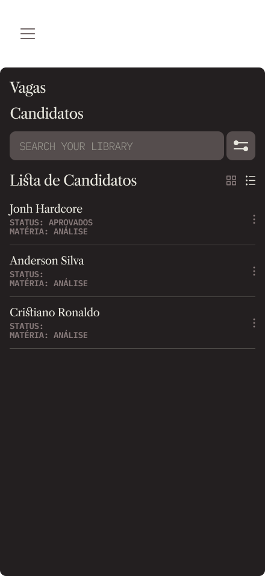

## Introdução

A construção do protótipo de alta fidelidade auxilia a equipe de desenvolvimento a encontrar um nível de detalhes abrangentes, extrair funcionalidades, testar usabilidade, e também fornece uma base para o gerenciamento do projeto pois com o protótipo é possível realizar estimativas de quanto tempo será necessário desempenhar em cada funcionalidade.

## Metodologia

Iniciamos o projeto através dos levantamentos iniciais da equipe, após discussões a ferramenta Figma foi selecionada para produzir o protótipo de alta fidelidade com auxílio do Material Design Color Tool.

## Protótipo de baixa fidelidade

### Versão 1.0

### Tela Login

### Tela Cadastro de Alunos

### Tela Cadastro de Professores

### Tela Cadastro de Vagas

### Tela Home

### Tela Dashboard

### Tela Lista de Vagas

### Tela Detalhes da Vaga

### Tela Painel do Monitor

### Tela Painel do Administrador

Na primeira versão do protótipo utilizamos a ferramenta <a href="https://material.io/resources/color/#!/?view.left=0&view.right=0">Material Design Color Tool</a>  para auxiliar na criação da paleta de cores do aplicativo, definimos as cores base do aplicativo mas as cores definidas para as telas 12 e 13 ainda não foram decididas.

### Versão 1.0

link para o `<a href="https://www.figma.com/design/pBnwhRAnD0LddgZ96sGIuD/PBE?node-id=0-1&p=f">`Protótipo no Figma`</a>`
> senha: frello 

---
## Conclusão

A partir da elaboração do protótipo foi possível ter uma noção inicial da interface do usuário, definindo fluxo, paleta de cores, botões, app bars e diversas outras funcionalidades

## Referências

> Material Design Color Tool. Disponível em:  https://material.io/resources/color/#!/?view.left=0&view.right=0

> PMI. Um guia do conhecimento em gerenciamento de projetos. Guia PMBOK® 5a. ed. EUA: Project Management Institute, 2013.

> Ferramenta Figma. Disponível em https://www.figma.com

## Autor(es)

| Data     | Versão | Descrição                            | Autor(es)                                                                            |
| -------- | ------- | -------------------------------------- | ------------------------------------------------------------------------------------ |
| 19/09/25 | 1.0     | Criação do documento                 | Sarah Ferrari                                                |
| 19/09/25 | 1.1     | Criação das imagens do protótipo    | João Victor                                              |

